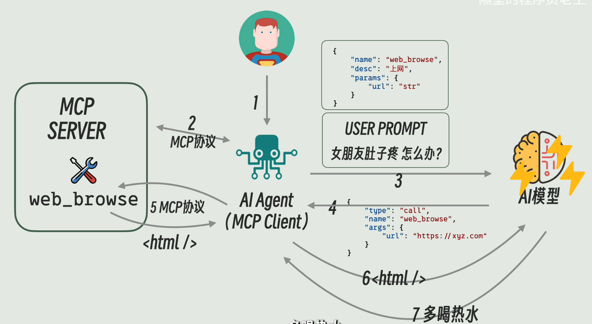

# 基础概念

在了解后端就业前景的时候，一个前辈给了使用AI搭建应用程序的实践建议，接下来的几天我将按照基础概念了解、字节开源的`Eino`开发框架学习、项目实际开发、工程问题分析和场景设计这套流程进行AI应用开发的学习

# Generative AI

生成式人工智能，是我们了解使用LLM并且进行AI应用开发的最基础概念。

## 基础模型

LLMs的基础概念是`Foundation Models`（基础模型）。在传统AI开发中，通常需要为每个特定任务（task-specific）训练独立的专用模型，而基础模型代表了一种新范式：通过**单一通用模型**的海量预训练，取代了传统针对不同任务的碎片化模型库。

这种范式下的基础模型，通过**自监督学习**（如预测下一个词）在大量数据（包括非结构化文本、代码等）上训练，获得通用能力。它能够适配多种下游任务（如问答、翻译），而无需针对每个任务从头训练。其中，**具备生成能力**的基础模型（如GPT），能够基于输入内容预测并生成后续文本（或图像、代码等），这类模型被称为生成式人工智能（Generative AI），属于基础模型的一个重要分支。不同于特定模型从零开始，针对单一任务（如情绪分类）用标注数据直接训练，基础模型自监督性学习的目标是掌握通用语言/视觉等能力，而非解决具体任务。

我简单举一个训练一个能够识别语句情绪的基础模型的例子，首先需要收集大量带有情绪标签的文本数据（如影评、社交媒体帖子等），然后选择一个预训练好的基础模型（如BERT或GPT），通过微调的方式让模型学习情绪分类任务：在保持原有语言理解能力的同时，使用标注数据调整模型参数，使其能够准确判断输入文本的情绪倾向（如积极、消极或中性）。最终模型既能理解通用语言特征，又具备专业的情绪识别能力。

基础模型从训练初期就走了一条"先通才，后专才"的路径，其核心价值在于通过预训练建立通用理解能力，再灵活迁移到下游任务，这与直接训练特定任务的模型有根本性差异。

## 训练

如果在训练模型时，在等式中运入少量标记数据，可以调整它们执行传统的NLP任务（分类或者命名实体识别）。上面的例子被称为**调优（tuning）**，通过引入少量数据来调整基础模型，更新模型参数，然后执行非常具体的自然语言任务。

只有少量数据点，采用这样的模型可以在低签领域通过设计输入文本（提示词/Prompt）来引导模型生成 desired 的输出，**无需重新训练模型**，这种形式被称为提示词工程。

| 维度             | 调优（Fine-tuning） | 提示词工程（Prompt Engineering） |
| :--------------- | :------------------ | :------------------------------- |
| **是否需要训练** | 需要                | 不需要                           |
| **数据需求**     | 大量标注数据        | 无需数据（但需设计技巧）         |
| **成本**         | 高（算力、时间）    | 低（仅人工设计）                 |
| **灵活性**       | 修改需重新训练      | 可即时调整Prompt                 |
| **效果上限**     | 通常更高            | 受限于预训练模型                 |

## 优势与不足

基础模型这种训练方式的优势主要有以下两点：

1. 性能表现上很好，大量的数据训练使得基础模型的表现优于在几个数据点上训练处的特定模型
2. 生产力提高，经过prompting或者tuning，所需标签数少了很多

同时，主要缺点也有下面两点：

1. 基础模型训练成本高，需要数据集数据量大，推理运行如此大量数据也很昂贵
2. 信任性问题，大量数据很多无法被严格筛选与标注、使用开源模型很多时候原有参数无法保证可信性

# Prompt Agent MCP `FunctionCalling`

## Prompt

我们来拿聊天AI举例，当我向`kimi`问一句"你好"的时候，这句"你好"被称为用户提示词（user prompt）。

而在一些对话应用中，用户是可以选择偏好的，比如语言风格或者一些其他习惯，这部分信息会存储在系统提示词（system prompt）中

用户提示词和系统提示词会打包发给AI模型

## Agent

Agent被称为智能体，我觉得更形象的翻译应该是"代理"。

最早的一款agent是`AutoGPT`，是一款安装在本地的agent程序。用户需要自己准备一些工具，如查看文件目录、修改文件目录等等的脚本，以方便其使用，这些脚本的位置和使用方式存储在system-prompt里面，和用户的需求（比如删除原神）一起发给AI模型，AI模型会将如何调用怎么做返回给Agent，重复这个过程直到任务完成。

在Agent和AI模型对话的过程中，存在AI模型出现幻觉的问题，这个时候最直接的方法就是重新将问题问给模型，直到回答出想要的答案

## `FunctionCalling`

在调用AI模型时，单纯的重复可能会造成随机性延时以及token消耗过多的情况，因此使用`functioncalling`取代系统提示词的规范形式。`functioncalling`规范了Agent询问和AI模型回答的格式，一般将某个工具的信息、使用方式存储在一个`json`文本中，这些文本统一放在一个地方并且和User-Prompt一起发给模型。模型回复的信息也规定了格式，如果出现幻觉模型可以自行纠正。

## MCP

和`functioncalling`有异曲同工之妙的MCP规定了Agent调用工具的规范协议。

此前，这些工具一般和Agent放在一个应用程序中运行，但是为了提高效率以及跨机运行（本机使用io、跨机使用http），使用MCP协议进行解耦，这些工具被统称为"MCP Server" 而调用他们的Agent被称为"MCP Client"，MCP规范了Server要提供的接口类型以及规范格式，Server提供了工具、提示词模板和资源。

下面就是用户请求，Agent处理，模型处理的一个基本流程



# Transformer

Transformer 是现代大语言模型的基础架构，由 Google 在 2017 年的论文《Attention Is All You Need》中提出。

## 核心思想

传统 RNN/LSTM 模型处理序列时存在两个问题：
1. **串行计算**：无法并行，训练慢
2. **长距离依赖**：序列越长，信息丢失越严重

Transformer 通过 **自注意力机制（Self-Attention）** 解决了这两个问题。

## 架构组成

```
┌─────────────────────────────────────────────────────────────────┐
│                    Transformer 架构                              │
├─────────────────────────────────────────────────────────────────┤
│                                                                 │
│  输入嵌入 (Input Embedding) + 位置编码 (Positional Encoding)    │
│      │                                                          │
│      ▼                                                          │
│  ┌───────────────────────────────────────┐                     │
│  │           Encoder 层 × N               │                     │
│  │  ┌─────────────────────────────────┐  │                     │
│  │  │  Multi-Head Self-Attention      │  │                     │
│  │  │  Add & Norm                     │  │                     │
│  │  │  Feed Forward Network           │  │                     │
│  │  │  Add & Norm                     │  │                     │
│  │  └─────────────────────────────────┘  │                     │
│  └───────────────────────────────────────┘                     │
│      │                                                          │
│      ▼                                                          │
│  ┌───────────────────────────────────────┐                     │
│  │           Decoder 层 × N               │                     │
│  │  ┌─────────────────────────────────┐  │                     │
│  │  │  Masked Self-Attention          │  │                     │
│  │  │  Cross-Attention (Encoder-Decoder)│ │                     │
│  │  │  Feed Forward Network           │  │                     │
│  │  └─────────────────────────────────┘  │                     │
│  └───────────────────────────────────────┘                     │
│      │                                                          │
│      ▼                                                          │
│  输出层 (Linear + Softmax)                                      │
│                                                                 │
└─────────────────────────────────────────────────────────────────┘
```

## 自注意力机制

核心公式：`Attention(Q, K, V) = softmax(QK^T / √d_k) V`

- **Q (Query)**：查询向量
- **K (Key)**：键向量
- **V (Value)**：值向量

直观理解：每个词可以"关注"到序列中的其他词，计算相关性权重，加权求和得到新的表示。

## 关键创新

| 创新 | 说明 |
|------|------|
| **位置编码** | 因为没有循环结构，需要显式注入位置信息 |
| **多头注意力** | 多组 Q/K/V，捕获不同类型的关系 |
| **残差连接 + LayerNorm** | 深层网络训练稳定 |
| **前馈网络 (FFN)** | 增加非线性表达能力 |

## GPT vs BERT

| 模型 | 架构 | 预训练任务 | 特点 |
|------|------|-----------|------|
| **GPT** | Decoder-only | 预测下一个词 | 生成能力强 |
| **BERT** | Encoder-only | 掩码语言模型 | 理解能力强 |
| **T5** | Encoder-Decoder | 文本到文本 | 通用性强 |

# Vibe Coding / Cursor

## 什么是 Vibe Coding

Vibe Coding 是一种新兴的编程范式，由 Andrej Karpathy 在 2025 年提出。核心理念是：

> "我写的不是代码，而是描述我想要什么，让 AI 来实现。"

**特点**：
- 用自然语言描述需求
- AI 生成代码
- 开发者负责审查和测试
- 强调"氛围"而非精确语法

## Cursor 编辑器

Cursor 是基于 VS Code 的 AI 编程编辑器，深度集成了 LLM 能力。

### 核心功能

```
┌─────────────────────────────────────────────────────────────────┐
│                    Cursor 核心功能                               │
├─────────────────────────────────────────────────────────────────┤
│                                                                 │
│  1. Chat (Ctrl+L)                                               │
│     - 与 AI 对话，询问代码问题                                   │
│     - AI 可以看到当前文件上下文                                  │
│                                                                 │
│  2. Edit (Ctrl+K)                                               │
│     - 选中代码，用自然语言描述修改                               │
│     - AI 直接修改代码                                           │
│                                                                 │
│  3. Composer (Ctrl+I)                                           │
│     - 多文件编辑                                                │
│     - AI 理解项目结构，跨文件修改                                │
│                                                                 │
│  4. Tab 补全                                                    │
│     - AI 预测下一个编辑位置                                     │
│     - 智能代码补全                                              │
│                                                                 │
│  5. @Codebase                                                   │
│     - AI 索引整个代码库                                         │
│     - 可以回答关于项目的问题                                    │
│                                                                 │
└─────────────────────────────────────────────────────────────────┘
```

### 使用技巧

1. **提供上下文**：使用 `@文件名` 引用特定文件
2. **分步请求**：复杂任务拆分成小步骤
3. **审查代码**：AI 生成的代码需要人工审查
4. **迭代优化**：不满足预期时继续对话调整

# Agentic AI Workflow (Dify / n8n)

## 什么是 Agentic AI

Agentic AI（代理式 AI）是指 AI 系统能够：
- 自主规划和分解任务
- 调用工具执行操作
- 根据结果调整策略
- 循环执行直到目标完成

## 工作流框架对比

### Dify

Dify 是一个开源的 LLM 应用开发平台，提供可视化界面构建 AI 应用。

```
┌─────────────────────────────────────────────────────────────────┐
│                    Dify 核心能力                                 │
├─────────────────────────────────────────────────────────────────┤
│                                                                 │
│  1. 可视化编排                                                  │
│     - 拖拽式工作流设计                                          │
│     - 节点：LLM、工具、条件分支、代码执行                        │
│                                                                 │
│  2. RAG 引擎                                                    │
│     - 内置向量数据库                                            │
│     - 文档上传、切片、索引                                      │
│                                                                 │
│  3. Agent 能力                                                  │
│     - Function Calling                                          │
│     - 多工具编排                                                │
│                                                                 │
│  4. 模型支持                                                    │
│     - OpenAI、Claude、文心一言等                                │
│     - 支持本地模型                                              │
│                                                                 │
└─────────────────────────────────────────────────────────────────┘
```

### n8n

n8n 是一个通用的自动化工作流平台，支持 AI 节点。

```
┌─────────────────────────────────────────────────────────────────┐
│                    n8n 特点                                      │
├─────────────────────────────────────────────────────────────────┤
│                                                                 │
│  • 通用自动化：不仅限于 AI，可连接 400+ 服务                     │
│  • 自托管：可部署在自己的服务器                                  │
│  • 低代码：可视化拖拽，也支持代码节点                            │
│  • AI 集成：OpenAI、LangChain 节点                              │
│                                                                 │
│  典型场景：                                                      │
│  邮件触发 → AI 分析 → 更新数据库 → 发送通知                     │
│                                                                 │
└─────────────────────────────────────────────────────────────────┘
```

### 对比总结

| 特性 | Dify | n8n |
|------|------|-----|
| 定位 | AI 应用开发平台 | 通用自动化平台 |
| AI 能力 | 原生支持 | 插件支持 |
| 学习曲线 | 中等 | 较低 |
| 自定义 | 中等 | 高 |
| 适用场景 | AI 产品 | 业务自动化 |

# Cline — VSCode 的 AI 编程插件

## 简介

Cline（前身为 Claude Dev）是一个自主 AI 编程助手，作为 VS Code 插件运行。

## 核心能力

```
┌─────────────────────────────────────────────────────────────────┐
│                    Cline 工作流程                                │
├─────────────────────────────────────────────────────────────────┤
│                                                                 │
│  用户: "帮我创建一个用户登录功能"                                │
│      │                                                          │
│      ▼                                                          │
│  ┌───────────────────────────────────────┐                     │
│  │  Cline 自主执行                        │                     │
│  │  1. 分析项目结构                       │                     │
│  │  2. 规划实现步骤                       │                     │
│  │  3. 创建/修改文件                      │                     │
│  │  4. 运行命令（如 npm install）         │                     │
│  │  5. 测试验证                           │                     │
│  │  6. 终端输出反馈给用户                 │                     │
│  └───────────────────────────────────────┘                     │
│      │                                                          │
│      ▼                                                          │
│  用户审查确认                                                   │
│                                                                 │
└─────────────────────────────────────────────────────────────────┘
```

## 与 Cursor 的区别

| 特性 | Cline | Cursor |
|------|-------|--------|
| 自主性 | 高（可自主执行多步骤） | 中（需要用户引导） |
| 终端访问 | 支持 | 支持 |
| 文件操作 | 自主创建/修改 | 需要用户确认 |
| 代码审查 | 自动运行测试 | 人工审查 |
| 适用场景 | 完整功能开发 | 辅助编码 |

## 使用场景

- 快速原型开发
- 代码重构
- Bug 修复
- 文档生成
- 测试编写

# RAG (Retrieval-Augmented Generation)

## 什么是 RAG

RAG（检索增强生成）是一种结合外部知识库的 LLM 应用架构，解决 LLM 的以下问题：
- 知识过时（训练数据截止日期）
- 幻觉问题（编造不存在的信息）
- 领域知识缺失

## 架构流程

```
┌─────────────────────────────────────────────────────────────────┐
│                    RAG 架构流程                                  │
├─────────────────────────────────────────────────────────────────┤
│                                                                 │
│  【离线阶段】                                                   │
│  文档 → 切片 → Embedding → 向量数据库                           │
│                                                                 │
│  【在线阶段】                                                   │
│  用户查询                                                       │
│      │                                                          │
│      ▼                                                          │
│  Query Embedding（查询向量化）                                  │
│      │                                                          │
│      ▼                                                          │
│  向量检索（相似度搜索）                                         │
│      │                                                          │
│      ▼                                                          │
│  Top-K 相关文档                                                 │
│      │                                                          │
│      ▼                                                          │
│  构建 Prompt（查询 + 上下文）                                   │
│      │                                                          │
│      ▼                                                          │
│  LLM 生成回答                                                   │
│                                                                 │
└─────────────────────────────────────────────────────────────────┘
```

## 关键组件

| 组件 | 说明 | 常见选择 |
|------|------|---------|
| 文档加载器 | 读取各种格式文档 | PDF/Word/TXT 解析器 |
| 文本切分器 | 将长文档切分成小块 | 固定长度/语义切分 |
| Embedding 模型 | 文本向量化 | text-embedding-3-small |
| 向量数据库 | 存储和检索向量 | Milvus/Pinecone/Chroma |
| Reranker | 重排序检索结果 | Cohere Rerank/BGE Rerank |

## RAG vs Fine-tuning

| 维度 | RAG | Fine-tuning |
|------|-----|-------------|
| 知识更新 | 实时（更新知识库） | 需要重新训练 |
| 成本 | 低（无需训练） | 高（需要 GPU） |
| 可解释性 | 高（可追溯来源） | 低（黑盒） |
| 适用场景 | 知识密集型问答 | 特定任务优化 |
| 实现难度 | 中等 | 高 |

# VectorDB (向量数据库)

## 什么是向量数据库

向量数据库是专门用于存储、索引和检索高维向量的数据库系统。

## 核心概念

```
┌─────────────────────────────────────────────────────────────────┐
│                    向量数据库核心概念                            │
├─────────────────────────────────────────────────────────────────┤
│                                                                 │
│  1. 向量 (Vector)                                               │
│     高维数值数组，如 [0.12, -0.34, 0.56, ...]                   │
│     语义相近的文本 → 向量距离近                                  │
│                                                                 │
│  2. 索引 (Index)                                                │
│     加速向量检索的数据结构                                      │
│     - IVF (倒排文件索引)                                        │
│     - HNSW (层次导航小世界图)                                   │
│     - ANNOY (随机投影树)                                        │
│                                                                 │
│  3. 相似度度量                                                  │
│     - 余弦相似度 (Cosine Similarity)                            │
│     - 欧几里得距离 (L2 Distance)                                │
│     - 内积 (Dot Product)                                        │
│                                                                 │
│  4. ANN (近似最近邻)                                            │
│     牺牲少量精度换取大幅性能提升                                 │
│     100万向量 → 暴力搜索 O(N) → ANN 搜索 O(log N)               │
│                                                                 │
└─────────────────────────────────────────────────────────────────┘
```

## 主流向量数据库

| 数据库 | 特点 | 适用场景 |
|--------|------|----------|
| **Milvus** | 开源、高性能、分布式 | 生产级大规模应用 |
| **Pinecone** | 全托管、易用 | 快速原型 |
| **Chroma** | 轻量、Python 原生 | 开发测试 |
| **Qdrant** | Rust 实现、高性能 | 对性能要求高的场景 |
| **Weaviate** | 语义搜索、GraphQL | 复杂查询场景 |

## 检索流程

```
查询文本 → Embedding → 向量搜索 → Top-K 结果 → Rerank → 最终结果
```

# CUDA

## 什么是 CUDA

CUDA (Compute Unified Device Architecture) 是 NVIDIA 推出的并行计算平台和编程模型，允许使用 GPU 进行通用计算。

## 为什么 AI 需要 CUDA

```
┌─────────────────────────────────────────────────────────────────┐
│                    CPU vs GPU 对比                               │
├─────────────────────────────────────────────────────────────────┤
│                                                                 │
│  CPU:                                                           │
│  • 少量强大核心 (8-64 核)                                        │
│  • 适合串行复杂逻辑                                              │
│  • 主频高，单核性能强                                            │
│                                                                 │
│  GPU:                                                           │
│  • 大量简单核心 (数千到上万)                                     │
│  • 适合大规模并行计算                                            │
│  • 矩阵运算天然并行                                              │
│                                                                 │
│  AI 训练/推理特点：                                              │
│  • 大量矩阵乘法                                                  │
│  • 计算密集、逻辑简单                                            │
│  • 完美匹配 GPU 特性                                             │
│                                                                 │
│  性能对比：                                                      │
│  • 训练速度：GPU 比 CPU 快 10-100 倍                            │
│  • 推理速度：GPU 比 CPU 快 5-20 倍                              │
│                                                                 │
└─────────────────────────────────────────────────────────────────┘
```

## CUDA 生态

| 组件 | 说明 |
|------|------|
| **CUDA Toolkit** | 开发工具包，包含编译器、库 |
| **cuDNN** | 深度学习加速库 |
| **TensorRT** | 推理优化引擎 |
| **NCCL** | 多 GPU 通信库 |
| **PyTorch/TensorFlow** | 深度学习框架，底层调用 CUDA |

## 开发者视角

作为应用开发者，通常不需要直接写 CUDA 代码：

```python
# PyTorch 自动使用 GPU
import torch

# 检查 CUDA 是否可用
device = torch.device("cuda" if torch.cuda.is_available() else "cpu")

# 模型移到 GPU
model = MyModel().to(device)

# 数据移到 GPU
inputs = inputs.to(device)
```

## 本地部署 LLM 的 CUDA 需求

| 模型规模 | 显存需求 | 推荐显卡 |
|---------|---------|---------|
| 7B 参数 | 14-16 GB | RTX 3090/4090 |
| 13B 参数 | 26-32 GB | A100 40GB |
| 70B 参数 | 140+ GB | 多卡 A100 |
