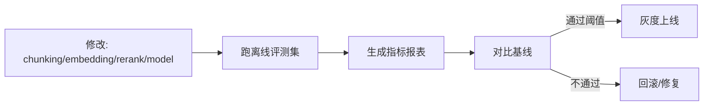

### 目标：把“可用”变成“可证明可回归”

教育场景最怕“偶发答错/幻觉”，所以工程上必须有一套**可观测性（Observability）+ 质量评测（Evaluation）**体系，把每一次生成的依据、链路耗时、质量指标沉淀下来，支持：

- 答辩/面试：说清楚如何保证可靠性。
- 线上运维：出现质量波动能快速定位（RAG？工具？模型？）。
- 迭代回归：每次改 chunking/embedding/model 都能量化对比。

---

### 1）最小可观测性：TraceID 打通全链路

每个用户请求生成 `trace_id`，贯穿：

- `api-gateway`：请求入口（用户、角色、课程、session_id）。
- `dialog-service/workflow-service/digital-human-service`：业务阶段与状态。
- `rag-service`：检索命中（doc_id、score、kb_version、重排结果）。
- `mcp-tools`：工具调用（tool_name、args 摘要、耗时、错误码、返回大小）。
- `llm-gateway`：模型路由（local/cloud）、耗时、token usage、流式 chunk 数。
- `content-service`：落库与文件 URL。

#### 1.1 结构化日志建议字段

- **基础字段**：`trace_id, user_id, role, course_id, class_id, session_id, timestamp`
- **RAG 字段**：`kb_version, top_docs=[{doc_id,score,chapter,page_range}]`
- **LLM 字段**：`model, provider, prompt_tokens, completion_tokens, latency_ms, error`
- **MCP 字段**：`tool_calls=[{name,latency_ms,status}]`

---

### 2）指标体系（Metrics）：建议最小集

- **可用性**
  - `llm_success_rate`：LLM 调用成功率（按 provider、模型版本分组）。
  - `rag_success_rate`：RAG 检索成功率（超时、空检索占比）。
  - `tool_success_rate`：工具成功率（按 tool 分组）。
- **性能**
  - P50/P95 latency：端到端、LLM、RAG、工具、渲染分别统计。
  - QPS、并发量、队列积压（数字人/渲染任务）。
- **成本**
  - token 消耗（按用户/学校/功能）。
  - GPU 利用率、显存占用（本地推理）。
- **质量**
  - 引用覆盖率：回答中是否包含有效引用。
  - “拒答/不知道率”：检索不到时是否合理拒答（而不是胡编）。

---

### 3）质量评测（Eval）：离线回归 + 在线抽检

#### 3.1 离线评测集（推荐构建方式）

- 来源：
  - 真实对话日志采样（教师常问、学生常错）。
  - 题库标准解析（有确定答案）。
  - 教材章节重点难点题（覆盖面）。
- 标注维度：
  - 正确性：正确/部分正确/错误。
  - 可解释性：是否引用了正确章节/资料。
  - 教学性：是否有步骤、是否针对薄弱点。

#### 3.2 回归流程（建议）

---

### 4）面试深挖问题准备

- 你如何证明 RAG 改造是“提升了正确率”而不是主观感觉？
- 当线上幻觉率升高时，你如何定位是“检索没命中”还是“模型胡编”？
- 你如何对不同学校/课程做灰度与 A/B？指标怎么看？

