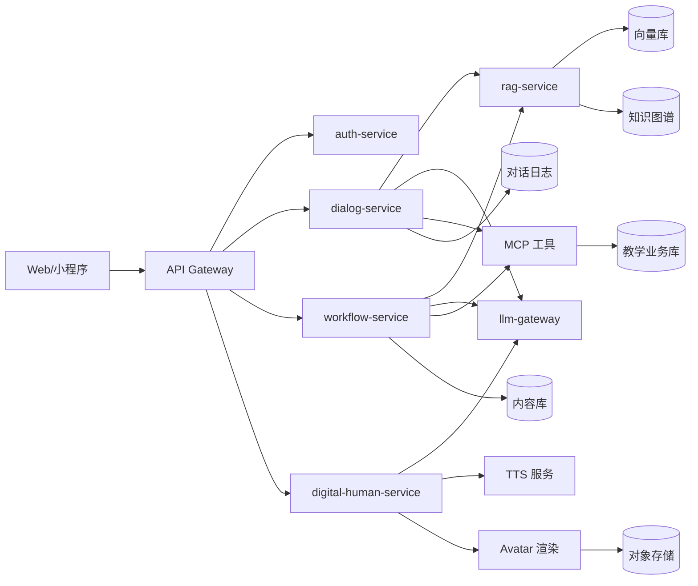

### 说明

本文档是根目录 `基础概念-总体架构与名词解释.md` 的**文件夹内归档版本**，内容保持一致，便于按目录提交与答辩展示。

---

### 一、项目整体定位

本项目是一个**面向中小学及高校教师的智慧备课与教学闭环平台**，围绕「备课—授课—辅导—复盘」四个环节，提供：

- **备课工作流**：教案生成、PPT 生成、习题编排、学情分析结果回流。
- **教学对话助手**：课堂与课后的智能问答、讲解和习题解析。
- **数字人（虚拟教师）**：基于教师画像生成讲解视频和微课。

底层通过**本地大模型 + RAG + 知识图谱 + MCP/SKILLS**统一驱动。

---

### 二、后端总体架构

- **接入层**
  - API Gateway（REST）对接 Web、小程序。
  - gRPC 在内部服务间通信。

- **业务服务层（Go 微服务）**
  - `auth-service`：用户、角色、权限。
  - `dialog-service`：教学对话助手。
  - `digital-human-service`：数字人生成。
  - `workflow-service`：备课工作流编排。
  - `rag-service`：RAG/知识图谱检索与重排。
  - `content-service`：教案、PPT、习题、视频等内容管理。

- **模型与知识层**
  - `llm-gateway`：统一封装大模型（本地 Qwen/QwQ + 云端 API），对上层暴露统一接口。
  - 本地知识库：向量库（Milvus/Qdrant/pgvector）+ 知识图谱（Neo4j 或关系型实现）。
  - MCP 工具 & SKILLS：对接教务数据、题库、教材等外部系统，并封装工作流能力。

- **存储与基础设施**
  - 关系型数据库（PostgreSQL/MySQL）存储业务数据。
  - 对象存储（MinIO/OSS）存放原始文档、PPT、视频等。
  - 日志与观测：Prometheus + Loki + Grafana。

#### 架构流程（Mermaid）



---

### 三、核心名词解释（结合本项目）

- **RAG（Retrieval-Augmented Generation）检索增强生成**
  - 将**检索到的教材/教案/题库内容**与用户问题一并交给大模型，以减少幻觉、对齐教材。
  - 在本项目中由 `rag-service` 统一实现，提供：
    - 问答检索（教学对话助手使用）。
    - 备课素材检索（教案/PPT/习题生成使用）。

- **本地知识库**
  - 由两部分组成：
    - 向量库：存文本片段（教材、教案、题目、错题解析等）的向量。
    - 知识图谱：存「知识点—章节—题目—学生表现」等结构化关系。
  - 所有业务场景都通过 `rag-service` 间接访问。

- **知识图谱**
  - 节点：知识点、章节、题目、学生/班级（可选）。
  - 边：`PRE_REQ`、`PART_OF`、`TESTS`、`WRONG_BY` 等。
  - 用于：缩小检索范围、提高可解释性、支撑学情分析与个性化。

- **MCP（Model Context Protocol）**
  - 大模型调用外部系统的统一协议。
  - 工具示例：`student_profile_tool`、`course_material_tool`、`exam_bank_tool`。

- **SKILLS**
  - 基于 MCP 工具和 LLM 编排出的「高层工作流能力」。
  - 示例：`lesson_plan_skill`、`ppt_generate_skill`、`digital_teacher_skill`。

---

### 四、统一 LLM 网关设计（Go 伪代码）

```go
type ChatMessage struct {
    Role    string `json:"role"`   // system/user/assistant/tool
    Content string `json:"content"`
}

type ChatRequest struct {
    Model       string        `json:"model"`
    Messages    []ChatMessage `json:"messages"`
    Temperature float32       `json:"temperature"`
    TraceID     string        `json:"trace_id"`
}

type ChatResponse struct {
    Answer string `json:"answer"`
}

type LLMGateway interface {
    Chat(ctx context.Context, req *ChatRequest) (*ChatResponse, error)
}
```

---

### 五、典型工程问题（面试/设计讨论）

- 如何在**多业务场景共享同一套 RAG 与知识图谱**，避免重复造轮子？
- 如何在**高并发情况下控制大模型调用成本**（缓存、批量请求、降级策略）？
- 如何设计**可观测性**：从一个用户请求，追踪到调用了哪些工具、哪些模型版本、检索了哪些文档？

