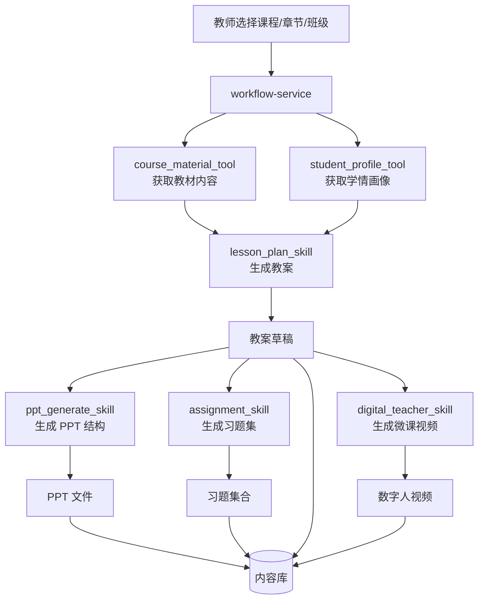

### 一、备课工作流业务范围

- **目标**：用一条「端到端备课流水线」连接教师和大模型：
  - 输入：课程/章节/教学对象（班级/年级）+ 教师偏好。
  - 输出：
    - 教案文档（教学目标、重难点、教学过程、板书设计等）。
    - PPT 草稿（每页标题、要点、图片/公式占位等）。
    - 习题集合（课中练习/课后作业，难度分层）。
    - 可选：自动生成对应数字人微课。

---

### 二、技术架构与组件

- **对外接口**
  - `POST /api/workflow/lesson`：触发完整备课工作流。
  - `GET /api/workflow/lesson/{id}`：查询工作流执行结果。

- **内部服务与依赖**
  - `workflow-service`：编排备课各步骤，负责状态机。
  - MCP 工具：
    - `course_material_tool`：按课程/章节获取教材内容与元数据。
    - `student_profile_tool`：获取班级学情（知识点掌握度）。
    - `exam_bank_tool`：按知识点与难度检索题目。
  - SKILLS：
    - `lesson_plan_skill`：生成教案结构与内容。
    - `ppt_generate_skill`：基于教案生成 PPT 结构。
    - `assignment_skill`：为每个知识点定制习题集合。
    - `digital_teacher_skill`（可选）：生成数字人微课。
  - `rag-service` + `llm-gateway`：所有 SKILL 底层依赖。
  - `content-service`：落库教案、PPT、习题、视频。

---

### 三、备课工作流整体流程（流程图）



---

### 四、工作流服务核心设计（Go 伪代码）

#### 4.1 输入/输出结构

```go
type LessonWorkflowRequest struct {
    TeacherID string `json:"teacher_id"`
    CourseID  string `json:"course_id"`
    ChapterID string `json:"chapter_id"`
    ClassID   string `json:"class_id"`
    GenerateDigitalVideo bool `json:"generate_digital_video"`
}

type LessonWorkflowResult struct {
    WorkflowID      string `json:"workflow_id"`
    LessonPlanID    string `json:"lesson_plan_id"`
    LessonPlanURL   string `json:"lesson_plan_url"`
    PPTURL          string `json:"ppt_url"`
    ExerciseSetID   string `json:"exercise_set_id"`
    DigitalVideoURL string `json:"digital_video_url,omitempty"`
    Status          string `json:"status"`
}
```

#### 4.2 编排主流程（同步伪代码，可扩展为异步状态机）

```go
func (s *WorkflowService) RunLessonWorkflow(ctx context.Context, req *LessonWorkflowRequest) (*LessonWorkflowResult, error) {
    wfID := newWorkflowID()

    // 1. 获取教材和学情
    material, err := s.mcp.CourseMaterial(ctx, req.CourseID, req.ChapterID)
    if err != nil {
        return nil, err
    }
    classProfile, err := s.mcp.StudentProfile(ctx, req.ClassID, req.CourseID)
    if err != nil {
        return nil, err
    }

    // 2. 调用 lesson_plan_skill 生成教案
    plan, err := s.skills.LessonPlanSkill(ctx, LessonPlanInput{
        Material:     material,
        ClassProfile: classProfile,
        TeacherID:    req.TeacherID,
    })
    if err != nil {
        return nil, err
    }

    // 3. 将教案落库
    planID, planURL, err := s.content.SaveLessonPlan(ctx, plan, ContentMeta{
        TeacherID: req.TeacherID,
        CourseID:  req.CourseID,
        ChapterID: req.ChapterID,
        ClassID:   req.ClassID,
    })
    if err != nil {
        return nil, err
    }

    // 4. 生成 PPT
    pptURL, err := s.skills.PPTGenerateSkill(ctx, PPTGenerateInput{
        Plan: plan,
    })
    if err != nil {
        return nil, err
    }

    // 5. 生成习题集
    exerciseSetID, err := s.skills.AssignmentSkill(ctx, AssignmentInput{
        Plan:         plan,
        ClassProfile: classProfile,
    })
    if err != nil {
        return nil, err
    }

    // 6. 可选：生成数字人视频
    var videoURL string
    if req.GenerateDigitalVideo {
        videoURL, _ = s.skills.DigitalTeacherSkill(ctx, DigitalTeacherInput{
            Plan:       plan,
            TeacherID:  req.TeacherID,
            FocusTopic: plan.KeyPoints[0],
        })
    }

    // 7. 记录工作流结果
    result := &LessonWorkflowResult{
        WorkflowID:      wfID,
        LessonPlanID:    planID,
        LessonPlanURL:   planURL,
        PPTURL:          pptURL,
        ExerciseSetID:   exerciseSetID,
        DigitalVideoURL: videoURL,
        Status:          "succeeded",
    }
    _ = s.repo.SaveWorkflowResult(ctx, result)

    return result, nil
}
```

---

### 五、SKILL 内部实现思路（示例伪代码）

#### 5.1 lesson_plan_skill

```go
type LessonPlanInput struct {
    Material     CourseMaterial
    ClassProfile ClassProfile
    TeacherID    string
}

type LessonPlan struct {
    Title       string
    Objectives  []string
    KeyPoints   []string
    Difficulties []string
    Steps       []TeachingStep
}

func (s *SkillsService) LessonPlanSkill(ctx context.Context, in LessonPlanInput) (*LessonPlan, error) {
    // 1. 从教材文本中抽取初始知识点(调用 rag-service 或单独的抽取模块)
    nodes := s.kg.ExtractNodesFromText(in.Material.Text)
    keyPoints := selectKeyPoints(nodes, in.ClassProfile)

    // 2. 构造 Prompt（包含教材片段+学情分析+教师偏好）
    prompt := buildLessonPlanPrompt(in.Material, in.ClassProfile, keyPoints)

    // 3. 调用大模型生成结构化教案(JSON)
    llmRes, err := s.llm.Chat(ctx, &ChatRequest{
        Model: "qwen-32b-edu",
        Messages: []ChatMessage{
            {Role: "system", Content: lessonPlanSystemPrompt()},
            {Role: "user", Content: prompt},
        },
        Temperature: 0.4,
    })
    if err != nil {
        return nil, err
    }

    plan, err := parseLessonPlanFromJSON(llmRes.Answer)
    if err != nil {
        return nil, err
    }
    return plan, nil
}
```

#### 5.2 ppt_generate_skill（思路）

- 输入：`LessonPlan`。
- 步骤：
  1. 将教案拆分为若干「页」：导入、每个知识点、例题、小结。
  2. 使用结构化 Prompt，让 LLM 输出每页的：
     - 标题、分点列表、是否需要图片/公式、备注。
  3. 返回 JSON 结构，交给 PPT 渲染引擎（如 python-pptx 或 Go 中调用渲染服务）生成实际 PPT 文件。

> 伪代码只描述关键接口：

```go
type PPTGenerateInput struct {
    Plan *LessonPlan
}

func (s *SkillsService) PPTGenerateSkill(ctx context.Context, in PPTGenerateInput) (string, error) {
    prompt := buildPPTOutlinePrompt(in.Plan)
    llmRes, err := s.llm.Chat(ctx, &ChatRequest{
        Model: "qwen-32b-edu",
        Messages: []ChatMessage{
            {Role: "system", Content: pptSystemPrompt()},
            {Role: "user", Content: prompt},
        },
    })
    if err != nil {
        return "", err
    }

    // 解析 LLM 输出的 JSON 结构
    pptSpec, err := parsePPTSpec(llmRes.Answer)
    if err != nil {
        return "", err
    }

    // 调用 PPT 渲染服务生成文件
    url, err := s.pptRenderer.Render(ctx, pptSpec)
    if err != nil {
        return "", err
    }

    return url, nil
}
```

---

### 六、学情分析与个性化设计

- **数据来源**
  - 作业/测验成绩明细。
  - 题目—知识点映射（来自知识图谱）。
  - 教学对话助手日志中频繁被问到的问题。

- **分析输出**
  - 班级维度：
    - 每个知识点的平均正确率、误区描述。
  - 学生维度：
    - 哪些知识点经常失误、哪些类型题更薄弱。

- **工作流中的使用方式**
  - 教案中：
    - 对掌握度低的知识点安排更多练习和讲解时间。
  - PPT 中：
    - 对薄弱知识点增加「易错点提示」页。
  - 习题集中：
    - 难度分层：基础题 + 变式题 + 拓展题。

---

### 七、工程实践与面试问题

1. **工作流编排**
   - 问：如果 PPT 生成失败但教案已经成功，系统应该如何对老师展示状态？是否支持局部重试？
2. **SKILL 粒度**
   - 问：你是如何划分 MCP 工具和 SKILL 粒度的？为什么不直接在后端写死逻辑？
3. **幂等与可重入**
   - 问：老师多次点击「重新生成」时，如何避免重复写入和资源浪费？
4. **可观测性**
   - 问：从一次备课工作流出发，怎样快速定位问题是在「MCP 数据」「RAG 检索」「模型生成」还是「渲染服务」？

