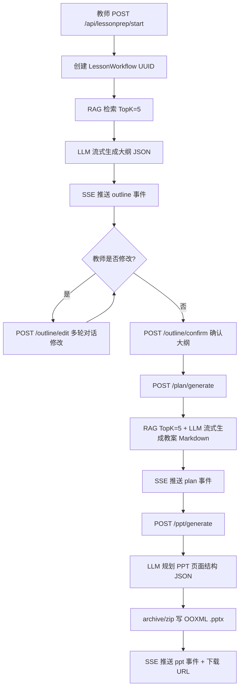

# 备课工作流 — 方案设计与具体实现

## 一、业务范围

教师输入课程主题，系统通过「端到端备课流水线」依次生成：

| 产物 | 格式 | 说明 |
|------|------|------|
| 课程大纲 | 结构化 JSON | 含三维目标、重难点、教学过程、板书设计 |
| 教案 | Markdown 全文 | 含教师话术、师生互动、史料引用 |
| PPT | `.pptx` 文件 | 原生 OOXML，12-18 页，多种幻灯片布局 |

教师可在大纲阶段多轮对话修改，确认后再推进教案与 PPT。

---

## 二、接口清单（`router/router.go`）

```
POST   /api/lessonprep/start              启动工作流，输入主题→SSE 流式输出大纲
POST   /api/lessonprep/outline/edit       对话式修改大纲（SSE）
POST   /api/lessonprep/outline/confirm    确认大纲，准备生成教案
GET    /api/lessonprep/outline            查询当前大纲 JSON
POST   /api/lessonprep/plan/generate      基于大纲生成教案（SSE）
GET    /api/lessonprep/plan               查询教案全文
POST   /api/lessonprep/ppt/generate       基于教案生成 PPT（SSE）
GET    /api/lessonprep/ppt/download       下载 .pptx 文件
GET    /api/lessonprep/status             工作流状态轮询
GET    /api/lessonprep/list               工作流历史列表
```

所有耗时接口均采用 **SSE（Server-Sent Events）** 推送进度，事件字段：

```json
{"type": "status|text|outline|plan|ppt|error|done", "content": "...", "data": {...}, "workflow_id": "..."}
```

---

## 三、状态机（`models/workflow.go`）

工作流 ID 为 UUID，状态流转如下：

```
init → outline_generating → outline_ready ⇄ outline_editing
                                  ↓
                           plan_generating → plan_ready
                                  ↓
                           ppt_generating → done
                                  ↓（任意阶段）
                                failed
```

对应常量（`models/workflow.go:11`）：

```go
WFStatusInit              = "init"
WFStatusOutlineGenerating = "outline_generating"
WFStatusOutlineReady      = "outline_ready"
WFStatusOutlineEditing    = "outline_editing"
WFStatusPlanGenerating    = "plan_generating"
WFStatusPlanReady         = "plan_ready"
WFStatusPPTGenerating     = "ppt_generating"
WFStatusDone              = "done"
WFStatusFailed            = "failed"
```

### 数据库表：`lesson_workflows`

| 字段 | 类型 | 说明 |
|------|------|------|
| `id` | varchar(64) | UUID 主键 |
| `user_id` | uint | 教师 ID |
| `status` | varchar(32) | 当前状态 |
| `topic` | varchar(255) | 课程主题 |
| `subject` | varchar(50) | 学科（默认"历史"）|
| `grade` | varchar(50) | 年级 |
| `duration` | int | 课时分钟（默认 45）|
| `outline_json` | json | 大纲结构体序列化 |
| `lesson_plan` | longtext | 教案 Markdown |
| `ppt_path` | varchar(500) | 生成的 .pptx 路径 |
| `error_msg` | text | 失败原因 |

附属表 `workflow_messages` 记录每阶段的多轮对话（workflow_id + stage + role + content）。

---

## 四、大纲生成（`services/lessonprep/outline.go`）

### 流程

1. **RAG 检索**：调用 `rag.Retriever.Search(topic, "all", 5)`，检索最多 5 条知识库片段（MySQL FULLTEXT 优先，降级 LIKE）
2. **构建 Prompt**：将 `grade/subject/topic/duration` + RAG 上下文组装为用户消息
3. **调用 LLM**：支持非流式（`llm.Client.Chat`）和流式（`llm.Client.StreamChat`）两种模式
4. **解析 JSON**：依次尝试直接解析 → 提取 ````json` 代码块 → 截取 `{...}` 片段

### 大纲 JSON 结构（`models/workflow.go:62`）

```go
type CourseOutline struct {
    Title           string          // 课程标题
    Subject         string          // 学科
    Grade           string          // 年级
    Duration        int             // 课时（分钟）
    Objectives      TeachObjectives // 三维目标
    KeyPoints       []string        // 教学重点
    DifficultPoints []string        // 教学难点
    Methods         []string        // 教学方法
    Process         []TeachProcess  // 教学过程（各环节）
    BoardDesign     string          // 板书设计
}

type TeachProcess struct {
    Stage    string  // 导入/新授/练习/小结/作业
    Duration int     // 分钟
    Activity string  // 教学活动描述
    Method   string  // 教学方法
}
```

---

## 五、大纲对话式修改（`services/lessonprep/outline_edit.go`）

`OutlineEditService.EditOutlineStream` 多轮修改逻辑：

1. 将**当前大纲 JSON** 作为首条 user 消息注入上下文
2. 从 `workflow_messages` 表中读取同 stage=`outline` 的历史对话追加到 messages
3. 末尾追加本轮修改请求，调用 LLM 流式输出
4. 解析返回 JSON，调用 `WorkflowManager.SaveOutline` 覆写数据库

System Prompt 要求模型：先用 1-2 句说明修改了什么，再在 ` ```json``` ` 代码块中输出完整修改后大纲。

---

## 六、教案生成（`services/lessonprep/lessonplan.go`）

- 以大纲 JSON + RAG 检索结果（TopK=5，maxLen=4000）构建 Prompt
- System Prompt：20 年教龄历史名师角色，要求包含教师话术、史料原文（《史记》《战国策》《左传》等）、师生互动
- 输出 Markdown 格式，包含七个章节：基本信息、教学目标、重难点、教学方法、教学过程（各环节含教师活动/学生活动/设计意图）、板书设计、教学反思（留白）
- 支持流式输出（`GenerateLessonPlanStream`），保存到 `lesson_workflows.lesson_plan`

---

## 七、PPT 生成（`services/lessonprep/pptgen.go`）

### 7.1 两步走

**Step 1** — LLM 规划页面结构：

将大纲 JSON + 教案前 4000 字发给 LLM，输出包含 12-18 张幻灯片的 JSON：

```json
{
  "slides": [
    {"type": "title",       "title": "...", "subtitle": "..."},
    {"type": "content",     "title": "...", "bullets": ["..."]},
    {"type": "interactive", "title": "...", "bullets": ["问题1", "问题2"]},
    {"type": "summary",     "title": "...", "bullets": ["要点1"]}
  ]
}
```

**Step 2** — 原生生成 `.pptx`：

不依赖任何第三方库，直接用 `archive/zip` 写入 OOXML 格式文件，包含：

| 文件路径 | 说明 |
|----------|------|
| `[Content_Types].xml` | 内容类型注册 |
| `ppt/presentation.xml` | 幻灯片列表与尺寸（4:3，9144000×6858000 EMU）|
| `ppt/theme/theme1.xml` | 历史主题色（暗红 `#8B0000` + 金黄 `#FFD700`）|
| `ppt/slides/slide{N}.xml` | 每张幻灯片 XML |
| `ppt/slideMasters/slideMaster1.xml` | 母版 |

### 7.2 幻灯片类型

| type | 背景 | 用途 |
|------|------|------|
| `title` | 暗红底色，金黄标题 | 封面页 |
| `content` | 白底，暗红顶部色带 | 常规内容页 |
| `interactive` | 米黄底色（`#FFF8DC`），问号符号 | 课堂互动/讨论 |
| `summary` | 暗红底色，白色正文 | 总结/作业页 |

文件保存路径：`runtime/ppt/{workflowID[:8]}_{title}.pptx`，下载 URL：`/api/lessonprep/ppt/download?workflow_id=xxx`

---

## 八、工作流管理器（`services/lessonprep/workflow.go`）

`WorkflowManager` 提供完整的数据库操作封装：

```go
CreateWorkflow(userID, topic, subject, grade, duration) // 创建并持久化，返回 UUID
UpdateStatus(workflowID, status)                         // 状态流转
SaveOutline(workflowID, outline)                         // 序列化 JSON 入库
GetOutline(workflowID)                                   // 反序列化返回 CourseOutline
SaveLessonPlan(workflowID, plan)                         // 教案全文入库
SavePPTPath(workflowID, pptPath)                         // PPT 路径入库 + 状态置 done
SetError(workflowID, errMsg)                             // 状态置 failed
AddMessage / GetMessages                                 // 多轮对话记录
ListWorkflows(userID, limit)                             // 工作流历史
```

---

## 九、整体流程图


