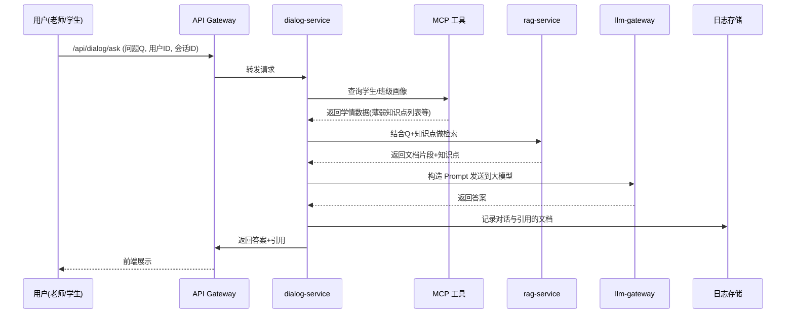

### 一、教学对话助手业务目标

- 为教师和学生提供「**高可信、可解释、个性化**」的教学问答服务：
  - 概念讲解、例题/习题解析、错因分析。
  - 课堂即时问答与课后巩固。
  - 面向不同学生的个性化讲解与题目推荐。

---

### 二、后端架构与依赖组件

- **对外接口**
  - HTTP REST：`POST /api/dialog/ask`
  - WebSocket（可选）：支持流式回答与课堂实时互动。

- **关键依赖**
  - `rag-service`：基于教材/教案/题库的本地知识检索。
  - `llm-gateway`：统一调用大模型（本地 Qwen/QwQ 为主）。
  - MCP 工具：
    - `student_profile_tool`：学生/班级学情画像。
    - `course_material_tool`：课程、章节元数据。
  - 存储：
    - 对话日志表：用于审计、复盘和后续微调。
    - 会话状态缓存（Redis）：保存多轮上下文摘要。

---

### 三、请求处理流程（时序图）



---

### 四、核心数据结构与 Go 伪代码

#### 4.1 请求/响应结构

```go
type DialogRequest struct {
    UserID    string `json:"user_id"`
    Role      string `json:"role"`      // teacher / student
    CourseID  string `json:"course_id"`
    ClassID   string `json:"class_id"`
    SessionID string `json:"session_id"`
    Question  string `json:"question"`
}

type SourceDoc struct {
    DocID       string  `json:"doc_id"`
    Title       string  `json:"title"`
    Snippet     string  `json:"snippet"`
    Score       float32 `json:"score"`
    SourceType  string  `json:"source_type"` // textbook/lesson/quiz
}

type DialogResponse struct {
    Answer   string      `json:"answer"`
    Sources  []SourceDoc `json:"sources"`
    TraceID  string      `json:"trace_id"`
}
```

#### 4.2 主处理流程

```go
func (s *DialogService) HandleDialog(ctx context.Context, req *DialogRequest) (*DialogResponse, error) {
    traceID := newTraceID()

    // 1. 拉取会话摘要（控制上下文长度）
    summary, _ := s.sessionStore.GetSummary(ctx, req.SessionID)

    // 2. 通过 MCP 获取学情画像（可根据 teacher/student 决定粒度）
    profile, _ := s.mcpClient.GetStudentProfile(ctx, req.UserID, req.CourseID, req.ClassID)

    // 3. 使用 RAG 检索与问题和画像相关的文档
    ragRes, err := s.ragClient.Retrieve(ctx, RAGRequest{
        Question:   req.Question,
        CourseID:   req.CourseID,
        ClassID:    req.ClassID,
        WeakPoints: profile.WeakPoints,
        TopK:       5,
    })
    if err != nil {
        return nil, err
    }

    // 4. 构造教学场景专用 Prompt
    prompt := BuildTeachingPrompt(req, summary, profile, ragRes.Sources)

    // 5. 调用 LLM
    llmRes, err := s.llmClient.Chat(ctx, &ChatRequest{
        Model: "qwen-32b-edu",
        Messages: []ChatMessage{
            {Role: "system", Content: systemPromptTeaching()},
            {Role: "user", Content: prompt},
        },
        Temperature: 0.3,
        TraceID:     traceID,
    })
    if err != nil {
        return nil, err
    }

    // 6. 对答案做后处理（格式化、敏感内容过滤等）
    finalAnswer := s.postProcessAnswer(llmRes.Answer)

    // 7. 更新会话摘要，减少后续 Prompt 长度
    _ = s.sessionStore.UpdateSummary(ctx, req.SessionID, req.Question, finalAnswer)

    // 8. 记录日志
    _ = s.logRepo.SaveDialog(ctx, &DialogLog{
        TraceID:  traceID,
        Request:  *req,
        Answer:   finalAnswer,
        Sources:  ragRes.Sources,
        Model:    "qwen-32b-edu",
    })

    return &DialogResponse{
        Answer:  finalAnswer,
        Sources: ragRes.Sources,
        TraceID: traceID,
    }, nil
}
```

#### 4.3 RAG 检索伪代码

```go
type RAGRequest struct {
    Question   string
    CourseID   string
    ClassID    string
    WeakPoints []string
    TopK       int
}

type RAGResult struct {
    Sources []SourceDoc
}

func (c *RAGClient) Retrieve(ctx context.Context, in RAGRequest) (*RAGResult, error) {
    // 1. 利用知识图谱筛出相关知识点/章节
    nodes := c.kg.QueryRelevantNodes(in.Question, in.CourseID, in.WeakPoints)
    candidateDocIDs := expandDocsFromNodes(nodes)

    // 2. 把问题编码成向量，做向量检索
    qVec := c.embedder.Embed(in.Question)
    docs := c.vectorStore.Search(ctx, qVec, candidateDocIDs, in.TopK*3)

    // 3. 用重排模型/规则做精排
    ranked := rerankAndSelect(docs, in.TopK)

    return &RAGResult{Sources: ranked}, nil
}
```

---

### 五、教学 Prompt 设计要点（文字描述）

- **System Prompt 关键约束**
  - 严格以「教材 + 教案 + 题库」为知识来源，不知道就说明「当前资料中未找到」。
  - 回答时指出知识点名称，并尽量引用来源（章节或题号）。
  - 面向学生时使用通俗语言，面向教师时可以更偏教学设计。

- **User Prompt 构造**
  - 问题原文。
  - 会话摘要（最近若干轮对话浓缩）。
  - 学情画像中该学生/班级的**薄弱知识点列表**。
  - RAG 检索到的文档片段（附带来源信息）。

---

### 六、工程实践要点

- **上下文控制**
  - 只保留最近 N 轮对话的摘要+当前问题，避免 Token 过长。
  - 重要的问题/答案可以额外写入「知识日志」，后续可用于再训练。

- **性能与成本**
  - 针对相同问题 + 相同课程的高频问答，可以缓存最终答案或 RAG 结果。
  - 对于学生大量并发提问时，按班级/课程级别做限流与降级策略。

- **安全与审计**
  - 对每次回答记录 TraceID，方便问题追溯。
  - 敏感内容（政治、隐私等）增加规则检查与策略回复。

---

### 七、面试/答辩可能问题

1. **RAG 设计**
   - 问：为什么要在教学对话中使用 RAG，而不是纯大模型？
   - 问：如何设计 RAG 的检索范围，避免把无关章节的内容检索进来？
2. **知识图谱结合**
   - 问：知识图谱在对话中的作用是什么？如果只用向量库会有什么问题？
3. **个性化讲解**
   - 问：你是如何把学生画像（弱点、兴趣）融入到回答中的？
4. **多轮对话**
   - 问：如果一个学生连续追问同一个知识点，如何保证上下文连续但不超出 Token 限制？
5. **稳定性与可观测性**
   - 问：当回答质量突然下降时，你从工程角度如何排查问题（RAG、模型、MCP 工具）？

