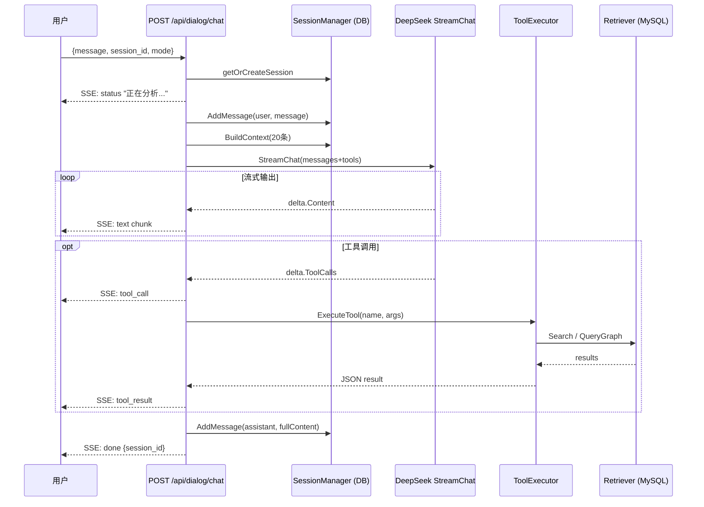

# 教学对话助手 — 方案设计与具体实现

## 一、业务目标

为教师和学生提供面向春秋战国历史课程的**高可信、可解释**教学问答服务：

- 历史人物、事件、战役、思想流派、诸侯国的知识问答
- 课堂即时问答（SSE 流式，低延迟）
- 多轮上下文问答，支持追问与延伸

---

## 二、接口清单（`router/router.go:104`）

```
POST   /api/dialog/chat      SSE 流式对话主接口
GET    /api/dialog/history   获取指定会话的消息历史
GET    /api/dialog/sessions  获取会话列表
POST   /api/dialog/search    直接搜索知识库（供前端调用）
```

---

## 三、请求结构（`controllers/dialog.go:36`）

```go
type ChatRequest struct {
    Message   string `json:"message"`    // 用户问题（必填）
    SessionID string `json:"session_id"` // 空字符串则创建新会话
    Mode      string `json:"mode"`       // local / online / auto
}
```

**Mode 说明：**

| Mode | 工具集 | 说明 |
|------|--------|------|
| `local` | `search_knowledge` + `query_graph` + `get_timeline` | 仅本地知识库 |
| `online` | 上述 + `web_search` | 增加 Serper API 联网搜索 |
| `auto` | 上述 + `web_search` | 与 online 相同，模型自行判断是否联网 |

---

## 四、SSE 事件协议（`controllers/dialog.go:43`）

```go
type SSEEvent struct {
    Type      string      `json:"type"`      // status|tool_call|tool_result|text|error|done
    Content   string      `json:"content,omitempty"`
    Tool      string      `json:"tool,omitempty"`
    Arguments interface{} `json:"arguments,omitempty"`
    Result    string      `json:"result,omitempty"`
    SessionID string      `json:"session_id,omitempty"`
}
```

前端逐 event 处理：`text` 追加显示，`tool_call` 展示工具调用状态，`done` 携带 session_id 供后续追问。

---

## 五、请求处理链路（`controllers/dialog.go:53`）

```
POST /api/dialog/chat
    ↓
getOrCreateSession（从 DB 获取或新建 Session）
    ↓
SSE 推送 "status: 正在分析问题..."
    ↓
AddMessage(session_id, "user", message)
首次对话自动截取前 20 字作为会话标题
    ↓
BuildContext：从 DB 读取最近 20 条历史消息 → []llm.Message
    ↓
buildSystemPrompt（注入角色定义 + mode 说明）
    ↓
BuildTools(mode)：按 mode 构造工具列表
    ↓
llm.Client.StreamChat(messages, tools, onChunk)
    ├─ delta.Content → SSE 推送 "text" 事件
    └─ delta.ToolCalls → SSE 推送 "tool_call" 事件
                          → ToolExecutor.ExecuteTool(name, args)
                          → SSE 推送 "tool_result" 事件
    ↓
AddMessage(session_id, "assistant", fullContent)
    ↓
SSE 推送 "done" 事件（携带 session_id）
```

---

## 六、LLM 客户端（`services/llm/client.go`）

底层调用 **DeepSeek API**（OpenAI 兼容格式），配置来源于 `config.AppConfig.DeepSeek`：

```go
type Client struct {
    APIKey  string
    BaseURL string
    Model   string
}
```

### 非流式：`Chat(messages, tools)`

发送 `POST /chat/completions`（`stream: false`），返回完整 `ChatResponse`。

### 流式：`StreamChat(messages, tools, onChunk)`

发送 `POST /chat/completions`（`stream: true`），用 `bufio.Scanner` 逐行读取 SSE，每行解析为 `StreamChunk`，通过回调 `onChunk` 传给上层：

```go
for scanner.Scan() {
    line := scanner.Text()
    if !strings.HasPrefix(line, "data: ") { continue }
    data := strings.TrimPrefix(line, "data: ")
    if data == "[DONE]" { break }
    json.Unmarshal([]byte(data), &chunk)
    onChunk(&chunk)
}
```

### 工具调用数据结构

```go
type ToolCall struct {
    ID       string       `json:"id"`
    Type     string       `json:"type"`
    Function FunctionCall `json:"function"`
}

type FunctionCall struct {
    Name      string          `json:"name"`
    Arguments json.RawMessage `json:"arguments"`
}
```

---

## 七、MCP 工具（`services/mcp/tools.go`）

`ToolExecutor` 注册四个工具，通过 `ExecuteTool(name, args)` 分发执行：

### `search_knowledge` — 知识库搜索

调用 `rag.Retriever.Search(query, category, limit)`，返回格式化 JSON：

```json
[{"id": 1, "title": "...", "category": "event", "content": "...", "score": 3.5}]
```

category 枚举：`person / event / battle / school / state / culture / all`

### `query_graph` — 知识图谱查询

调用 `graph.QueryService`：
- 精确匹配实体名称 → 返回实体及其所有关系
- 未命中 → 搜索相似实体，返回建议列表
- 支持按 `relation_type` 过滤（如 `BELONGS_TO`/`FOUNDED`/`PARTICIPATED`/`DEFEATED`/`ALLIED`）

### `get_timeline` — 时间线查询

按 `start_year`/`end_year`/`state` 筛选历史事件（功能开发中）

### `web_search` — 联网搜索

调用 **Serper API**（`POST {base_url}/search`），Header 携带 `X-API-KEY`，返回 organic 搜索结果的 title/url/snippet。仅在 `SERPER_API_KEY` 已配置时生效。

---

## 八、会话管理（`services/memory/session.go`）

`SessionManager` 基于 MySQL 提供完整的会话生命周期管理：

```go
CreateSession(userID, mode)              // 生成 UUID，写 DB
GetSession(sessionID)                    // Preload Messages
AddMessage(sessionID, role, content, ...) // 写 DB + 更新 updated_at
GetMessages(sessionID, limit)            // 按 created_at ASC 排序
BuildContext(sessionID, maxMessages)     // 返回 []llm.Message 供 LLM 调用
SummarizeHistory(sessionID)              // 超过 10 条时 LLM 压缩摘要
ListSessions(userID, limit)             // 按 updated_at DESC 排序
DeleteSession(sessionID)                 // 级联删除消息
UpdateTitle / GenerateTitle              // 会话标题管理
```

### 上下文窗口控制

`BuildContext` 默认取最近 20 条消息（`maxMessages=20`），避免 Token 超限。当消息超过 10 条时，`SummarizeHistory` 调用 LLM 将旧消息压缩为摘要，以 `system` role 存回 DB。

### 数据库表（`models/session.go` / `models/msg.go`）

**`sessions` 表**：`id(UUID)` / `user_id` / `mode` / `title` / `created_at` / `updated_at`

**`messages` 表**：`id(autoIncrement)` / `session_id(index)` / `role` / `content` / `tool_calls` / `tool_result` / `created_at`

---

## 九、RAG 检索（`services/rag/retriever.go`）

### 检索策略（两级降级）

1. **MySQL FULLTEXT 全文索引**（优先）：
   ```sql
   MATCH(title, content, keywords) AGAINST(? IN NATURAL LANGUAGE MODE)
   ```
2. **LIKE 模糊检索**（降级）：对提取的关键词逐字段 LIKE 匹配，limit×2 条候选

### 相关性打分（BM25 简化版）

```go
score += 3.0  // 标题命中
score += 2.0  // keywords 字段命中
score += count(content) * 0.5  // 内容出现次数
```

按分数排序后取 TopK，构建 `【参考资料】` 格式的上下文字符串注入 Prompt。

### `KnowledgeChunk` 分类（category 字段）

`person`（人物）/ `event`（事件）/ `battle`（战役）/ `school`（思想流派）/ `state`（诸侯国）/ `culture`（制度文化）

---

## 十、整体时序图


