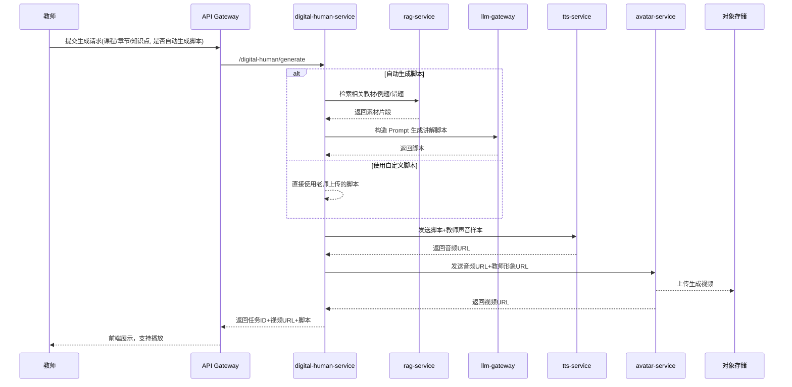

### 一、数字人（虚拟教师）业务场景

- **主要目标**
  - 基于教师的**声音样本 + 形象**自动生成讲解视频，服务于：
    - 重点难点微课。
    - 错题讲评、阶段总结。
    - 课前预习/课后复习小视频。

- **典型使用路径**
  1. 老师选择课程、章节或知识点。
  2. 选择「自动生成脚本」或上传自定义讲稿。
  3. 系统生成讲解脚本（如需要），然后调用 TTS + Avatar 渲染生成 mp4。
  4. 视频自动归档到内容库，并可在课堂或学生端播放。

---

### 二、后端整体架构

- **对外接口**
  - HTTP REST：`POST /api/digital-human/generate`
  - 任务查询：`GET /api/digital-human/task/{task_id}`

- **内部依赖组件**
  - `rag-service`：基于教材/错题/教案生成讲解素材。
  - `llm-gateway`：生成讲解脚本。
  - MCP 工具：
    - `course_material_tool`：按章节/知识点获取教材内容。
    - `exam_bank_tool`：获取相关例题或典型错题。
  - 外部/内部多媒体服务：
    - `tts-service`：个性化 TTS/声音克隆服务。
    - `avatar-service`：根据音频+教师形象生成带口型和表情的视频。
  - 存储：
    - 对象存储：存放音频和视频文件。
    - 元数据表：记录任务状态、脚本、URL 等。

---

### 三、数字人生成流程（时序图）



---

### 四、核心数据结构与 Go 伪代码

#### 4.1 请求/响应结构

```go
type DigitalHumanRequest struct {
    TeacherID string `json:"teacher_id"`
    CourseID  string `json:"course_id"`
    ChapterID string `json:"chapter_id,omitempty"`
    Topic     string `json:"topic"`        // 知识点名称或错题ID
    Script    string `json:"script,omitempty"` // 可选，空则自动生成
}

type DigitalHumanResponse struct {
    TaskID   string `json:"task_id"`
    Script   string `json:"script"`
    VideoURL string `json:"video_url,omitempty"` // 异步模式下可能为空
    Status   string `json:"status"`              // pending/running/succeeded/failed
}
```

#### 4.2 同步/异步任务处理示意

真实工程中通常使用**异步任务队列**防止长时间 HTTP 阻塞，这里给出伪代码示例：

```go
// HTTP Handler：创建任务并丢入队列
func (s *DigitalHumanService) HandleGenerate(w http.ResponseWriter, r *http.Request) {
    var req DigitalHumanRequest
    // 解析 JSON 省略

    taskID := newTaskID()
    task := &DigitalHumanTask{
        TaskID:    taskID,
        Request:   req,
        Status:    "pending",
        CreatedAt: time.Now(),
    }
    _ = s.repo.SaveTask(r.Context(), task)

    // 推入队列，由 worker 异步处理
    _ = s.queue.Enqueue(taskID)

    resp := DigitalHumanResponse{
        TaskID: taskID,
        Script: req.Script,
        Status: "pending",
    }
    writeJSON(w, resp)
}
```

```go
// Worker：消费队列，真正执行生成逻辑
func (s *DigitalHumanService) workerLoop(ctx context.Context) {
    for {
        taskID, err := s.queue.Dequeue(ctx)
        if err != nil {
            continue
        }
        if err := s.processTask(ctx, taskID); err != nil {
            // 错误处理、重试策略等
        }
    }
}
```

```go
func (s *DigitalHumanService) processTask(ctx context.Context, taskID string) error {
    task, err := s.repo.GetTask(ctx, taskID)
    if err != nil {
        return err
    }
    task.Status = "running"
    _ = s.repo.UpdateTask(ctx, task)

    script := task.Request.Script
    if script == "" {
        // 1. 调用 RAG 获取素材
        ragRes, _ := s.ragClient.Retrieve(ctx, RAGRequest{
            Question: fmt.Sprintf("讲解知识点：%s", task.Request.Topic),
            CourseID: task.Request.CourseID,
            TopK:     5,
        })

        // 2. 构造 Prompt 生成脚本
        prompt := buildDigitalTeacherScriptPrompt(task.Request, ragRes.Sources)
        llmRes, err := s.llmClient.Chat(ctx, &ChatRequest{
            Model: "qwen-32b-edu",
            Messages: []ChatMessage{
                {Role: "system", Content: digitalTeacherSystemPrompt()},
                {Role: "user", Content: prompt},
            },
            Temperature: 0.4,
            TraceID:     task.TaskID,
        })
        if err != nil {
            return err
        }
        script = llmRes.Answer
    }

    // 3. 获取教师画像（声音样本 & 形象）
    teacher, err := s.teacherRepo.GetProfile(ctx, task.Request.TeacherID)
    if err != nil {
        return err
    }

    // 4. 调用 TTS
    audioURL, err := s.ttsClient.Synthesize(ctx, TTSRequest{
        Text:           script,
        VoiceSampleURL: teacher.VoiceSampleURL,
    })
    if err != nil {
        return err
    }

    // 5. 调用 Avatar 服务生成视频
    videoURL, err := s.avatarClient.Render(ctx, AvatarRequest{
        AudioURL:       audioURL,
        AvatarImageURL: teacher.AvatarImageURL,
    })
    if err != nil {
        return err
    }

    // 6. 更新任务状态并落库
    task.Status = "succeeded"
    task.Script = script
    task.VideoURL = videoURL
    _ = s.repo.UpdateTask(ctx, task)

    return nil
}
```

---

### 五、脚本生成 Prompt 设计要点（文字）

- 教师视角：
  - 使用规范教学术语，结构包括「引入 → 知识讲解 → 例题演示 → 小结」。
  - 严格依据教材/教案，禁止编造超纲内容。
- 学生视角：
  - 通过 MCP 获取该班级/学生的主要薄弱点，在讲解中加入针对性提醒。
  - 融入简单提问和停顿，方便老师后期剪辑或配合课堂互动。

---

### 六、工程实践与风险控制

- **异步化与幂等性**
  - 视频生成耗时较长（几十秒到数分钟），必须采用任务队列，避免 HTTP 同步阻塞。
  - 使用 TaskID 作为幂等键，多次触发同一任务时可以直接返回已有结果。

- **资源与成本控制**
  - 可以将 TTS 结果缓存到对象存储，同一脚本+声音样本组合命中缓存时直接复用。
  - 批量生成时对 Avatar 服务做队列控制和并发限制，防止 GPU 过载。

- **合规与隐私**
  - 教师需明确授权上传肖像和声音样本，数据库中标记授权范围。
  - 对输出视频添加水印或标识，防止被挪作他用。

---

### 七、答辩可能问题

1. **链路设计**
   - 问：为什么数字人生成要做成异步任务而不是同步接口？
2. **脚本质量**
   - 问：如何保证自动生成的讲解脚本既专业又贴合教材，而不是随意发挥？
3. **多媒体流水线**
   - 问：TTS/Avatar/存储过程中出现失败时，如何做重试和回滚？如何保证用户不会拿到半成品？
4. **合规性**
   - 问：从工程角度，怎样设计接口和数据结构，确保教师能随时撤回对自己肖像/声音的授权？

