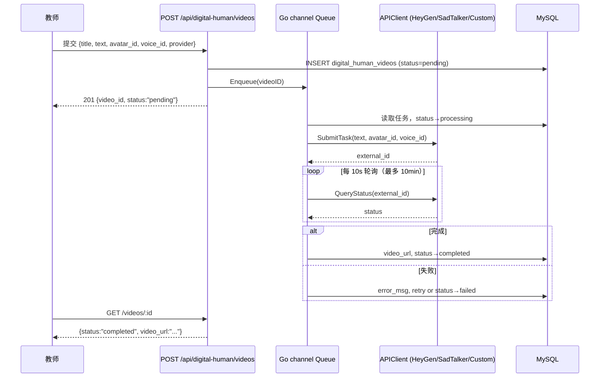

# 数字人 — 虚拟教师方案设计与具体实现

## 一、业务场景

教师提交讲解文本，系统调用 **预训练好的形象模型 + TTS 音色** 生成讲课视频，支持：

- 知识点微课（重点难点讲解）
- 错题讲评
- 课前预习 / 课后复习小视频

---

## 二、接口清单（`router/router.go:147`）

```
POST   /api/digital-human/videos           提交文本，触发生成任务
GET    /api/digital-human/videos/:id       查询单个任务状态 + 视频 URL
GET    /api/digital-human/videos           任务列表（分页，可按 status 过滤）
POST   /api/digital-human/videos/:id/retry 手动重试失败任务
DELETE /api/digital-human/videos/:id       取消 / 软删除任务
POST   /api/digital-human/webhook          接收外部 API 回调（HeyGen 等）
GET    /api/digital-human/avatars          获取可用数字人形象列表
```

---

## 三、数据模型（`models/digital_human.go`）

### `digital_human_videos` 主任务表

| 字段 | 类型 | 说明 |
|------|------|------|
| `id` | varchar(64) | UUID 主键 |
| `user_id` | uint | 提交者 |
| `title` | varchar(255) | 视频标题 |
| `text` | longtext | 输入讲解文本（TTS 驱动文本）|
| `avatar_id` | varchar(128) | 数字人形象 ID |
| `voice_id` | varchar(128) | 音色 ID |
| `language` | varchar(20) | 默认 `zh-CN` |
| `provider` | varchar(32) | API 提供商（`heygen`/`sadtalker`/`custom`）|
| `external_id` | varchar(128) | 外部 API 返回的任务 ID，用于轮询和 Webhook 匹配 |
| `status` | varchar(32) | `pending/processing/completed/failed/cancelled` |
| `video_url` | varchar(1024) | 成品视频播放 URL |
| `retry_count` | int | 当前重试次数 |
| `max_retry` | int | 最大重试次数（默认 3）|
| `error_msg` | text | 失败原因 |

### `digital_human_avatars` 形象预设表

| 字段 | 说明 |
|------|------|
| `avatar_id` | 唯一形象 ID |
| `name` | 展示名称（如"男教师（默认）"）|
| `provider` | 归属 API 提供商 |
| `is_active` | 是否启用 |

---

## 四、任务队列（`services/digitalhuman/queue.go`）

### 架构设计

采用**进程内 Go channel 队列 + 多 worker goroutine** 方案：

```go
type Queue struct {
    jobs       chan Job          // 容量 100 的 buffered channel
    workers    int               // 3 个并发 worker
    apiClients map[string]APIClient  // provider → client 策略映射
}
```

全局单例（`sync.Once`），服务启动时由 `NewDigitalHumanController` 触发初始化：

```go
func GetQueue() *Queue {
    once.Do(func() {
        // 注册三种 provider 的 APIClient
        globalQueue.apiClients["heygen"]    = NewHeyGenClient()
        globalQueue.apiClients["sadtalker"] = NewSadTalkerClient()
        globalQueue.apiClients["custom"]    = NewCustomClient()
        globalQueue.start()  // 启动 3 个 worker goroutine
    })
    return globalQueue
}
```

### 任务处理流程（`queue.go:processJob`）

```
Enqueue(videoID)
    ↓
从 DB 加载 DigitalHumanVideo
    ↓
根据 provider 选取 APIClient
    ↓
状态置 processing
    ↓
ExternalID 为空？ → SubmitTask → 写入 external_id
    ↓
pollStatus（每 10s 轮询，最多 10 分钟）
    ├─ completed → 写入 video_url，状态置 completed
    ├─ failed    → 进入重试逻辑
    └─ pending/processing → 继续轮询
```

### 重试策略（指数退避）

```go
// 重试延迟: 30s → 60s → 120s (retry_count = 1/2/3)
delay := time.Duration(30*(1<<(video.RetryCount-1))) * time.Second
```

- 重试时清空 `external_id`，重新走完整提交流程
- 超过 `max_retry`（默认 3 次）后标记 `failed`
- 支持通过 `POST /videos/:id/retry` 手动重置 retry_count 并重新入队

---

## 五、三种 API Provider（`services/digitalhuman/clients.go`）

所有 Provider 实现统一接口：

```go
type APIClient interface {
    SubmitTask(ctx context.Context, video *models.DigitalHumanVideo) (externalID string, err error)
    QueryStatus(ctx context.Context, externalID string) (status string, videoURL string, err error)
}
```

### HeyGen（商业 API）

- 提交：`POST https://api.heygen.com/v2/video/generate`，传入 `avatar_id` + `voice_id` + `input_text`
- 查询：`GET /v1/video_status.get?video_id=xxx`
- 认证：Header `X-Api-Key`
- 分辨率：1280×720（16:9）
- 配置：`HEYGEN_API_KEY`、`HEYGEN_DEFAULT_AVATAR_ID`、`HEYGEN_DEFAULT_VOICE_ID`

### SadTalker（开源，本地部署）

- 项目：`github.com/kenwaytis/faster-SadTalker-API`，默认 `http://localhost:10364`
- 提交：`POST /api/generate`，传入 `source_image`（图片 URL）+ `driven_text` + `language`，内部走 TTS 驱动
- 查询：`GET /api/status/{task_id}`
- 状态映射：`done→completed`，`running→processing`，`failed→failed`
- 配置：`SADTALKER_BASE_URL`

### Custom（ML 团队自训练模型）

- 提交：`POST /api/v1/digital-human/generate`，传入 `text`/`avatar_id`/`voice_id`/`language`
- 查询：`GET /api/v1/digital-human/task/{task_id}`
- 状态映射：`success→completed`，`error→failed`，`running→processing`
- 配置：`CUSTOM_DH_BASE_URL`、`CUSTOM_DH_API_KEY`（Bearer Token）

---

## 六、Webhook 回调（`controllers/digital_human.go:212`）

支持外部 API（如 HeyGen）主动推送任务结果：

```
POST /api/digital-human/webhook
Body: { "event_type": "avatar_video.success"|"avatar_video.fail", 
        "event_data": { "video_id": "<external_id>", "video_url": "..." } }
```

通过 `external_id` 匹配本地任务记录，更新 `status` 和 `video_url`，避免轮询等待。

---

## 七、生成链路时序图


